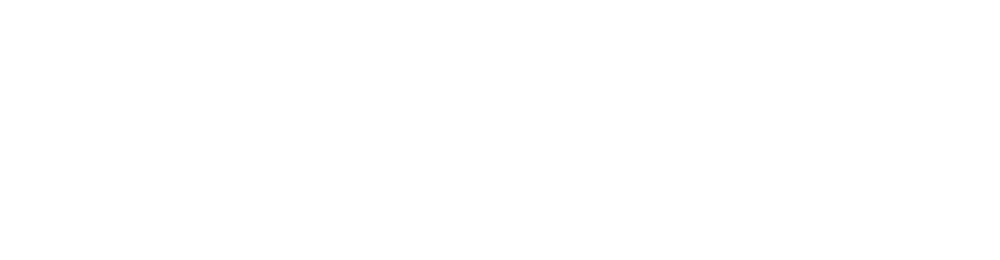
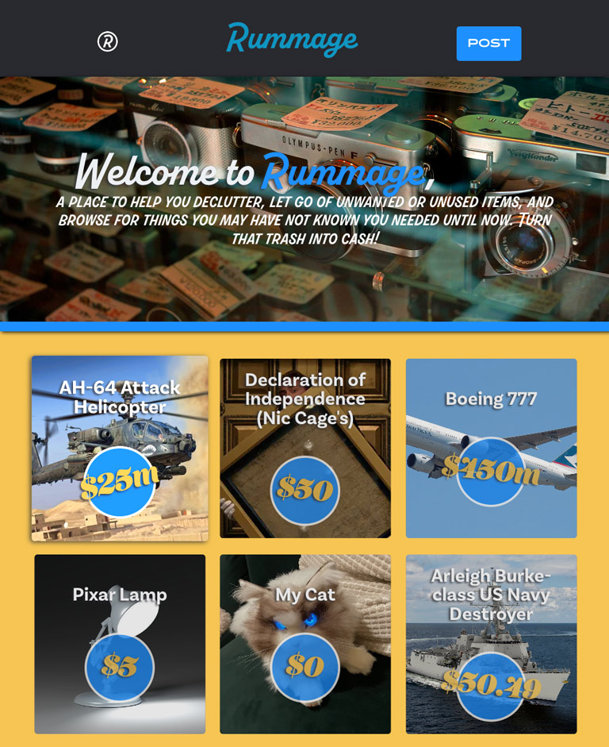
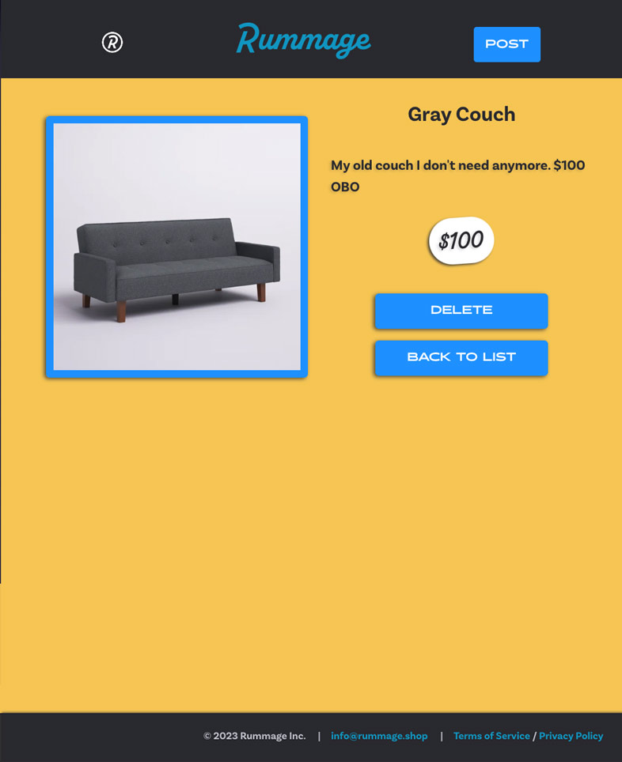

---

# Introduction

<table>
<tr>
<td>
  You are Rummaging through your basement find that old Pokemon card or that bike that you never use and think, "I bet this is worth alot of money, but where am i going to sell it". Bring it to Rummage. A Community based marketplace where people can buy/sell or give away items they no longer need. Turn that trash into cash baby! 
</td>
</tr>
</table>

# Technologies Used:

- React
- Node.js
- Express.js
- MongoDB
- Heroku
- Github
- JavaScript
- jQuery
- HTML5
- CSS3
- Figma
- Adobe Illustrator
- VS Code

# Getting Started

## Check it out here : https://rummage-rumg.netlify.app/

## The planning tools:

| <h2>Trello</h2>                             | <h2>Figma</h2>                                                      |     |
| ------------------------------------------- | ------------------------------------------------------------------- | --- |
| https://trello.com/b/hZJVNcsq/sei-project-3 | https://www.figma.com/file/RfVbcOhkL3ssf5qDtGhKfa/GA-SEIR-Project-3 |     |

   

# To-do / Future Enhancements

&check; - User is able to make listing  
&check; - User is able to delete listing  
&cross; - User is able to login and authorized to edit listing 
&cross; - User is able to contact another seller through email in item listing 
&cross; - User is able to upload multiple items to display in image gallery.

## Unsolved Issues:

- How to allow user authentication for image upload
- Best way to allow communication between buyers + sellers

# The Team

| <h2>Lehi Cano</h2>                                                                          | <h2>Moe Ahmed</h2>                                                                                | <h2>Jimmy Huang</h2>                                                                             |
| ------------------------------------------------------------------------------------------- | ------------------------------------------------------------------------------------------------- | ------------------------------------------------------------------------------------------------ |
| Product Manager + Lead Frontend                                                             | Remote Git Manager + Deployment                                                                   | Lead Backend + Quality Assurance                                                                 |
|  |  |  |
